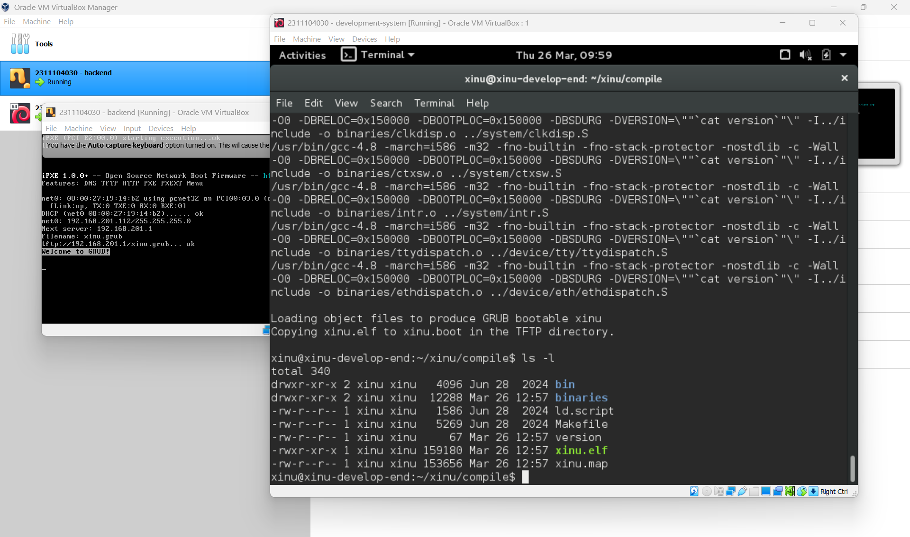
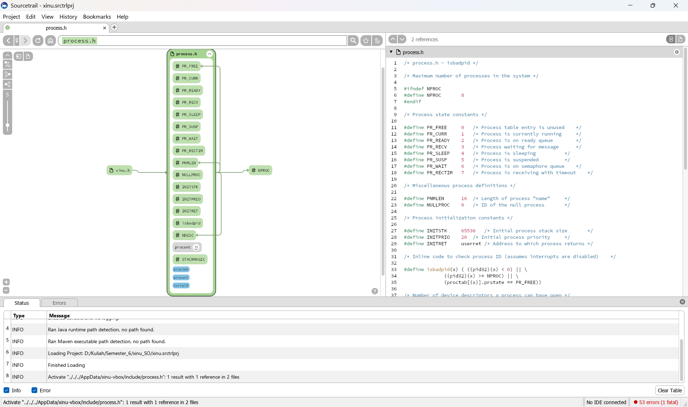
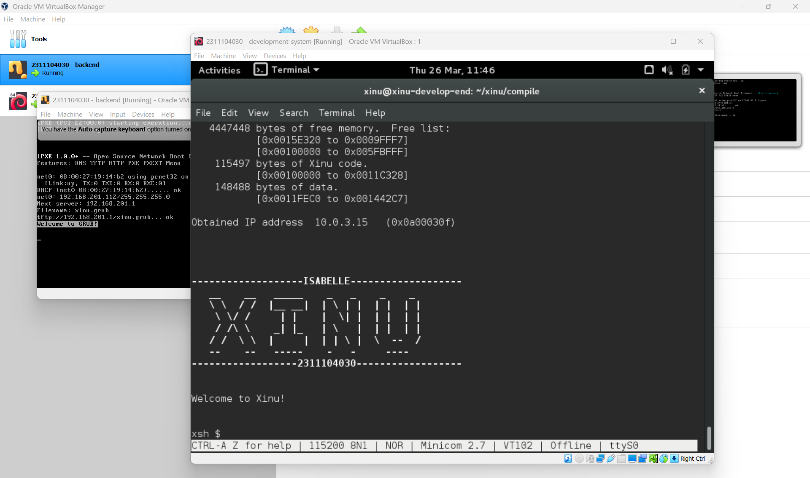

# <h1 align="center">Laporan Praktikum Modul 4   Membaca Source Code Xinu</h1>

Isabelle Putri Ardini - 2311104030

## Dasar Teori

Sistem operasi Xinu (Xinu Is Not Unix) merupakan sistem operasi yang didesain untuk tujuan pendidikan dan sistem embedded. Salah satu karakteristik utama Xinu adalah strukturnya yang ramping sehingga memudahkan mahasiswa untuk mempelajari konsep internal sistem operasi secara langsung melalui pembacaan kode sumber (source code). Dalam pengembangannya, Xinu menggunakan bahasa pemrograman C.    
Untuk memahami struktur kode yang kompleks, digunakan alat bantu seperti Sourcetrail, sebuah software penjelajah kode sumber yang memungkinkan visualisasi keterkaitan antar fungsi, variabel, dan struktur data dalam bentuk grafis atau mapping. Membaca kode sumber adalah keterampilan krusial bagi seorang programmer karena memberikan wawasan tentang bagaimana sebuah sistem dibangun dan bagaimana setiap komponen berinteraksi satu sama lain. 

## Guided

### 1. Persiapan Lingkungan Kerja 
Langkah pertama adalah memastikan alat bantu eksplorasi kode sudah terpasang.  
- Instalasi Sourcetrail: Unduh dan instal Sourcetrail dari tautan yang disediakan di LMS atau melalui situs resmi.  
- Persiapan Source Code: Unduh file source code Xinu yang tersedia di LMS, kemudian ekstrak ke direktori kerja. 
   
### 2. Konfigurasi Project di Sourcetrail
- Buka Sourcetrail dan buat project baru dengan nama "xinu".  

- Tambahkan Source Group dengan memilih bahasa C dan opsi Empty C Source Group.  

- Masukkan seluruh folder Xinu ke dalam bagian Files & Directories to Index.  

- Atur Include Paths ke direktori .../xinu/include agar definisi header dapat terdeteksi dengan benar.  

- Klik Create dan tunggu proses indeksasi selesai.  

## Jawaban Pertanyaan Jurnal
### Soal 1:
**Nama Image:** Berdasarkan file hijau yang muncul, namanya adalah xinu.elf atau hasil salinannya yaitu "xinu.boot".
**Ukuran File:** Untuk xinu.elf, ukurannya adalah 159180 bytes.
**Folder:** /home/xinu/xinu/compile.

### Soal 2:
Informasi yang disimpan dalam struktur data tersebut (sesuai yang terlihat di kode sebelah kanan) adalah: 
- **prstate**: Status proses (baris 44).
- **prprio**: Prioritas proses (baris 45).
- **prstkptr**: Penunjuk stack yang disimpan (baris 46).
- **prname**: Nama proses (baris 49).
- **prparent**: ID dari proses yang membuat (baris 51).

Cara Membaca Grafik dan Kode:
1. **Kotak Hijau (Kiri):** Itu adalah visualisasi dari file "process.h". Di situ bisa melihat konstanta seperti PR_FREE, PR_CURR, dan yang paling penting adalah kotak bertuliskan procent di bagian bawah.  
2. **Panel Kode (Kanan):** Di baris 43 sampai 55, bisa melihat isi dari struct procent secara detail.

### Soal 3:
**Nama File Struktur Data:** Struktur data proses pada Xinu OS didefinisikan dalam file "process.h".
**Lokasi File:** File ini berada di direktori "xinu/include/process.h".
**Informasi yang Disimpan:** Di dalam file tersebut terdapat sebuah struktur bernama struct procent yang menyimpan informasi vital untuk setiap proses, antara lain:
- prstate: Menyimpan status proses saat ini (seperti PR_CURR, PR_FREE, PR_READY, dsb).
- prprio: Menyimpan tingkat prioritas proses untuk keperluan penjadwalan (scheduling).
- prstkptr: Penunjuk (pointer) ke lokasi stack yang disimpan saat terjadi perpindahan konteks.
- prname: Array karakter yang menyimpan nama identitas dari proses tersebut.
- prparent: ID proses (pid) dari proses induk yang membuat proses tersebut.
- prstklen: Panjang atau ukuran stack proses dalam satuan bytes. 

### Soal 4:

## Referensi

1. https://en.wikipedia.org/wiki/Xinu (diakses 25 Maret 2026)
2. Modul 4 Praktikum Sistem Operasi: Membaca Source Code Xinu.
3. Video Penjelasan Modul 4 SO oleh muh—agha—zul (YouTube).