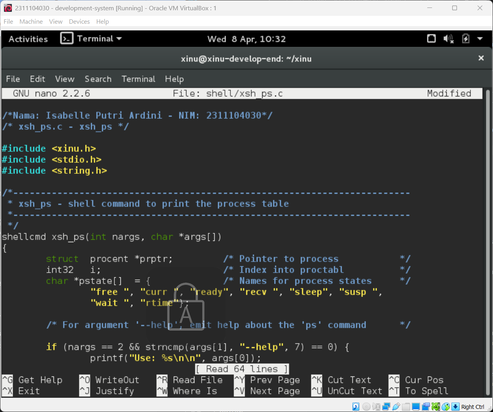
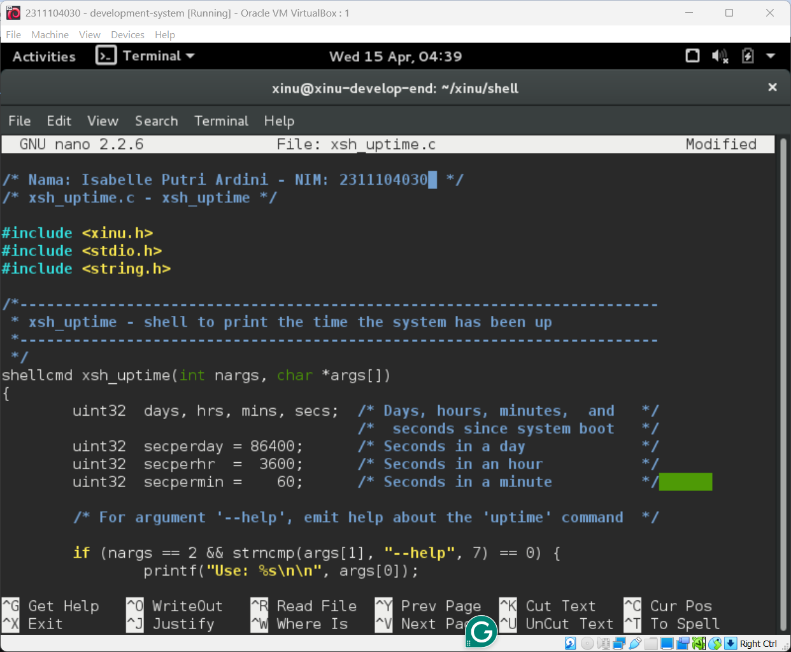
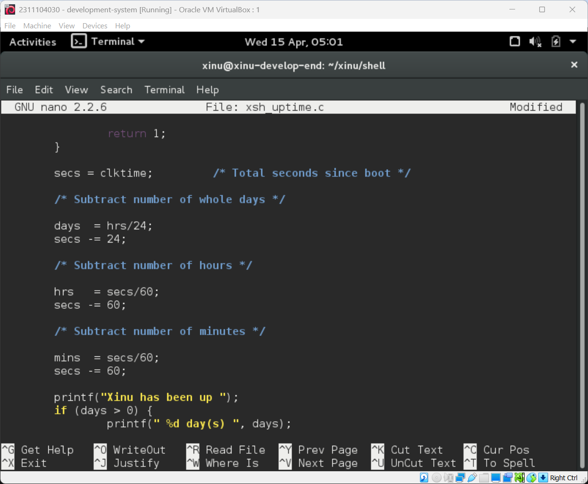

# <h1 align="center">Laporan Praktikum Modul 5   Eksplorasi Proses Xinu</h1>

Isabelle Putri Ardini - 2311104030

## Dasar Teori

Xinu (Xinu Is Not Unix) adalah sistem operasi yang didesain untuk keperluan edukasi yang memiliki struktur proses yang ringan. Setiap proses dalam Xinu direpresentasikan oleh sebuah struktur data yang disebut Process Control Block (PCB). PCB menyimpan informasi penting seperti status proses (state), prioritas, alamat stack, serta mekanisme pengiriman pesan (message passing).   
Dalam Xinu, pengelolaan proses melibatkan beberapa state utama seperti PR_CURR (sedang berjalan), PR_READY (siap dijalankan), PR_RECV (menunggu pesan), dan PR_WAIT (menunggu semaphore). Modifikasi pada perintah sistem seperti ps dan uptime dilakukan dengan mengubah kode sumber pada direktori shell, kemudian melakukan kompilasi ulang menggunakan compiler silang.
## Guided

### 1. Berdasarkan dokumentasi Xinu: 
- Maksimum Proses: Biasanya didefinisikan oleh konstanta NPROC, secara default adalah 50 proses.  
- Maksimal Panjang Nama: Didefinisikan oleh PNMLEN, yaitu 16 karakter (termasuk null terminator).  
- Nilai Prioritas Awal: Proses pengguna biasanya dimulai dengan prioritas 20. 
- Total State Xinu: Terdapat 9 state, yaitu: FREE, CURR, READY, RECV, SLEEP, SUSP, WAIT, RECTIME, dan SND.
   
### 2. Memberi Komentar pada xsf_ps.c
- Buka file shell/xsh_ps.c.

- Tambahkan Nama & NIM di bagian paling atas

- Scroll ke 20 baris terakhir.
- Tambahkan komentar di setiap baris menggunakan // atau /* */.

### 3. Modifikasi Perintah ps
- Cari bagian header tabel dan tambahkan kolom Msg dan Content.

- Tambahkan logika pada looping

### 4. Modifikasi Perintah uptime
- Buka file shell/xsh_uptime.c.
- Cari bagian yang menghitung waktu (biasanya pakai variabel clktime).
- Ubah rumusnya: total detik dibagi 60.
- Kompilasi lagi dan jalankan $ uptime.

## Referensi

1. Comer, D. (2015). Operating System Design: The Xinu Approach. CRC Press.
2. Xinu Documentation: https://xinu.cs.purdue.edu/ (diakses April 2026).
3. Tutorial Eksplorasi Proses Xinu: https://youtu.be/zABT2rGYfAc.