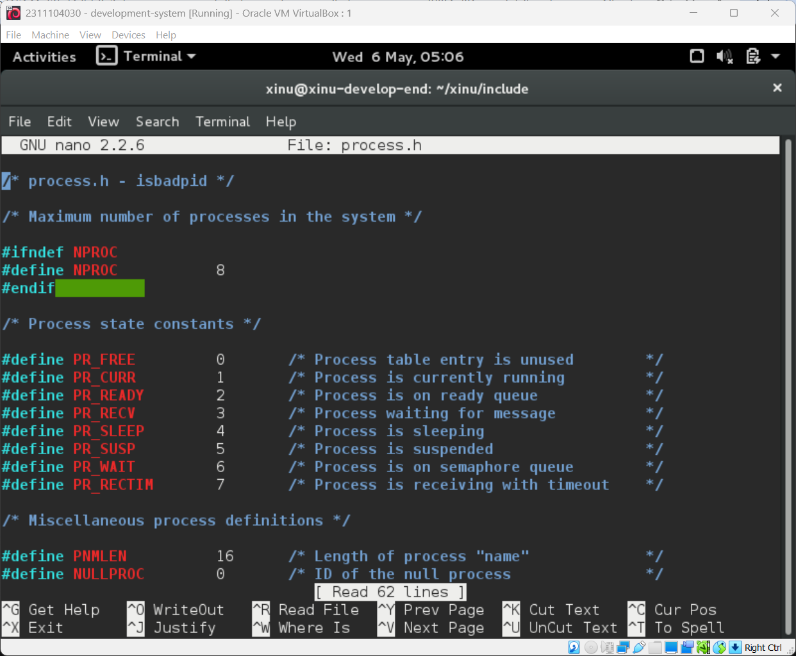
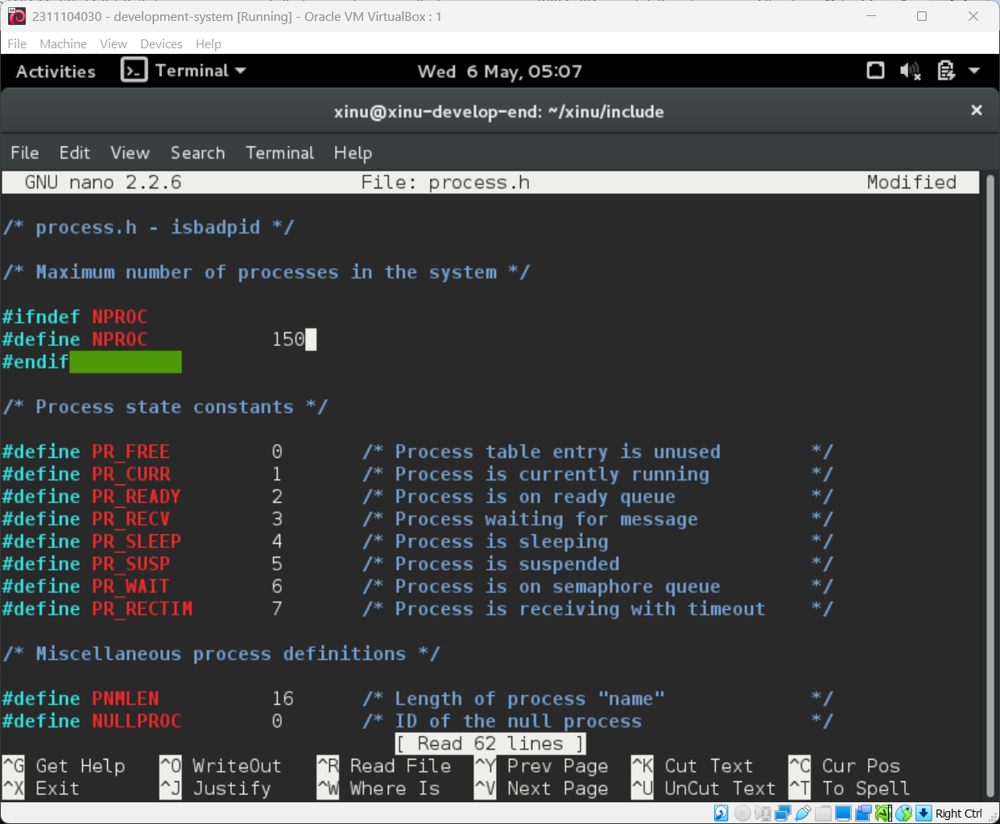
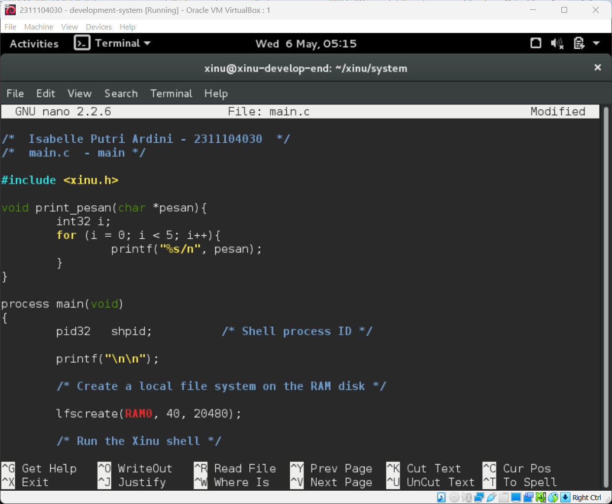

# <h1 align="center">Laporan Praktikum Modul 06   Sekuensial dan Konkuren</h1>

Isabelle Putri Ardini - 2311104030

## Dasar Teori
Sistem operasi Xinu mengelola eksekusi tugas melalui konsep proses. Terdapat dua cara utama dalam menjalankan proses, yaitu:
- Proses Sekuensial: Proses yang dijalankan satu demi satu secara berurutan. Sebuah proses baru akan dimulai hanya setelah proses sebelumnya selesai dieksekusi.
- Proses Konkuren: Proses yang dijalankan secara bersamaan dalam satu waktu. Dalam sistem single-processor, hal ini biasanya dicapai melalui time-sharing atau context switching yang cepat sehingga terlihat seolah-olah berjalan beriringan.
- Process Control Block (PCB): Struktur data yang menyimpan informasi mengenai status, prioritas, dan identitas setiap proses di dalam sistem.
- Race Condition: Kondisi yang terjadi saat dua atau lebih proses mengakses sumber daya (variabel) yang sama secara bersamaan, yang dapat mengakibatkan hasil akhir yang tidak konsisten.

## Guided

### 1. Batasan Maksimal Proses
Dalam sistem operasi Xinu, batasan maksimal proses tidak ditentukan di /proc seperti Linux, melainkan didefinisikan dalam file konfigurasi kernel.  
- Lokasi Definisi: Batasan ini dapat ditemukan pada source code Xinu di dalam file header konfigurasi, biasanya bernama process.h atau conf.h.  
- Maksimal Proses Default: Pada Xinu, konstanta yang mengatur hal ini adalah NPROC.  
- Modifikasi: Untuk mengubah batas maksimal menjadi 150 proses, praktikan perlu mengubah baris #define NPROC menjadi #define NPROC 150 dan melakukan kompilasi ulang pada kernel.  
Screenshot:  
- Awal: 

- Sesudah diubah: 

### 2. Eksekusi Kode Sekuensial
Eksekusi sekuensial memastikan bahwa setiap fungsi atau proses dipanggil dan diselesaikan secara runtut. Dalam praktikum ini, proses dijalankan tanpa menggunakan perintah resume(create(...)) secara konkuren, sehingga output akan muncul secara teratur sesuai urutan pemanggilan di fungsi main. 
Screenshot: 

### 3. Eksekusi Kode Konkuren
Pada eksekusi konkuren, proses dibuat menggunakan fungsi create dan dijalankan menggunakan resume. Hal ini memungkinkan penjadwal (scheduler) Xinu untuk membagi waktu CPU antar proses, sehingga output dari berbagai proses akan muncul secara bergantian atau acak tergantung pada time slice yang diberikan sistem. 
Screenshot: 

### 4. Problem Produser & Konsumer
Dalam soal ini, terdapat dua proses yang berbagi variabel global int32 n = 0. 
- Gejala: Hasil output n pada proses konsumer tidak akan urut 1-1000 dan sering kali tidak sesuai dengan jumlah yang diproduksi oleh produser. 
- Analisis: Hal ini terjadi karena Race Condition. Karena tidak ada mekanisme sinkronisasi (seperti semaphore), proses produser mungkin telah melakukan iterasi n++ berkali-kali sebelum proses konsumer sempat mengeksekusi perintah printf. Akibatnya, nilai n yang dicetak sudah melompat jauh dari nilai sebelumnya.   
Screenshot: 

## Referensi

1. Modul Praktikum Sistem Operasi
2. Douglas Comer, Operating System Design: The Xinu Approach