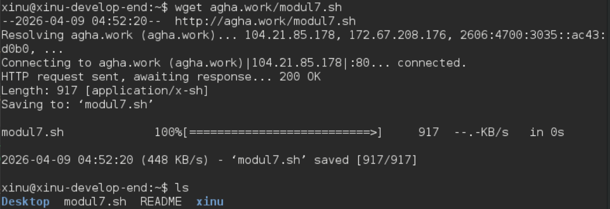
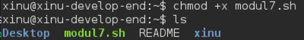
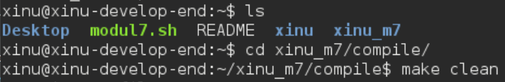

# <h1 align="center">Laporan Praktikum Modul 7   Semaphore</h1>

Isabelle Putri Ardini - 2311104030

## Dasar Teori

Semaphore adalah sebuah variabel atau tipe data abstrak yang digunakan untuk mengontrol akses oleh beberapa proses ke sumber daya bersama dalam sistem konkuren atau lingkungan multi-programming. Semaphore diperkenalkan pertama kali oleh Edsger Dijkstra untuk menangani masalah sinkronisasi antar proses. Secara teknis, semaphore bekerja dengan menyimpan nilai integer yang menunjukkan ketersediaan sumber daya.  

Terdapat dua operasi utama dalam semaphore:
1. Wait (P): Operasi ini akan menurunkan nilai semaphore. Jika nilai semaphore sudah nol, maka proses yang memanggilnya akan tertahan (blocked) hingga nilai tersebut menjadi lebih dari nol.
2. Signal (V): Operasi ini akan menaikkan nilai semaphore, menandakan bahwa proses telah selesai menggunakan sumber daya dan proses lain yang sedang menunggu dapat melanjutkan eksekusinya.

Semaphore sangat krusial dalam menghindari kondisi race condition dan memastikan mutual exclusion, di mana hanya ada satu proses yang dapat mengakses critical section pada satu waktu tertentu.

## Guided

### 1. Sinkronisasi Proses "Kwak Kwik Kwek"
Pada tugas pertama, kita diminta untuk mengoordinasikan tiga buah proses (P1, P2, dan P3) agar mencetak output secara berurutan: "Kwak", lalu "Kwik", dan terakhir "Kwek" secara berulang. 
- Mekanisme: Kita menggunakan tiga buah semaphore untuk mengatur urutan eksekusi. Semaphore pertama memberikan izin kepada P1. Setelah P1 mencetak "Kwak", ia akan memberikan sinyal kepada semaphore kedua agar P2 bisa berjalan.
- Alur: Setelah P2 mencetak "Kwik", ia akan memberikan sinyal kepada semaphore ketiga untuk menjalankan P3. Terakhir, setelah P3 mencetak "Kwek", ia akan memberikan sinyal kembali ke semaphore pertama sehingga siklus dapat berulang dengan rapi. Hal ini memastikan tidak ada proses yang mencetak teks di luar urutan yang ditentukan.

### 2. Permasalahan Producer-Consumer dengan Semaphore
Tugas kedua mengimplementasikan skema klasik Producer-Consumer. Di sini, terdapat dua proses konkuren yang harus bekerja secara bergantian: satu memproduksi data (angka 1-1000) dan satu lagi mengonsumsinya (menampilkan angka tersebut). 
- Mekanisme: Program ini menggunakan dua buah semaphore (misalnya sem_prod dan sem_cons) untuk sinkronisasi.
- Proses: Produser akan menunggu giliran melalui semaphore, memproduksi angka, lalu memberikan sinyal kepada Konsumer bahwa data sudah siap. Kemudian, konsumer akan menunggu sinyal dari Produser, menampilkan angka yang diterima, lalu memberikan sinyal kembali kepada Produser untuk memproduksi angka berikutnya.
- Hasil: Dengan menggunakan semaphore, kita menjamin bahwa Konsumer tidak akan mencoba menampilkan angka yang belum dibuat oleh Produser, dan Produser tidak akan menimpa data sebelum Konsumer selesai menampilkannya.

Langkah-langkah:
- Jalankan perintah **wget agha.work/modul7.sh** dan jalankan **ls** untuk mengecek  

- Jalankan perintah **chmod +x modul7.sh** dan jalankan **ls** untuk mengecek  

- Jalankan **cat modul7.sh** dan cek menggunakan **ls**  

- Jalankan  

- Jalankan **bebek** dan **prodcon**  

## Referensi

1. Modul Praktikum Sistem Operasi
2. Silberschatz, A., Galvin, P. B., & Gagne, G. (2018). Operating System Concepts (10th ed.). Wiley.(diakses 20 April 2026)