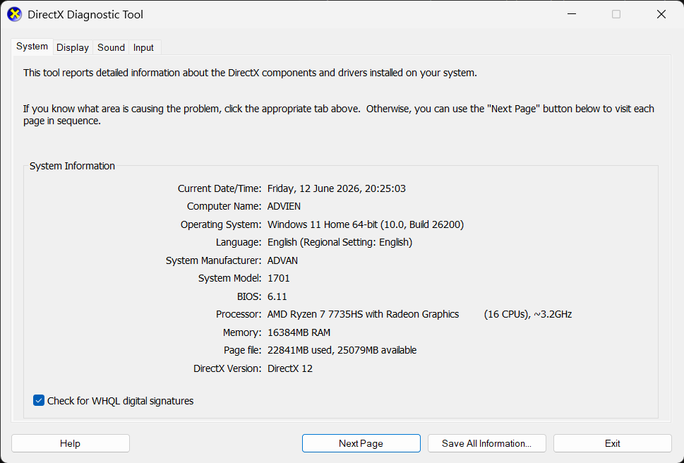
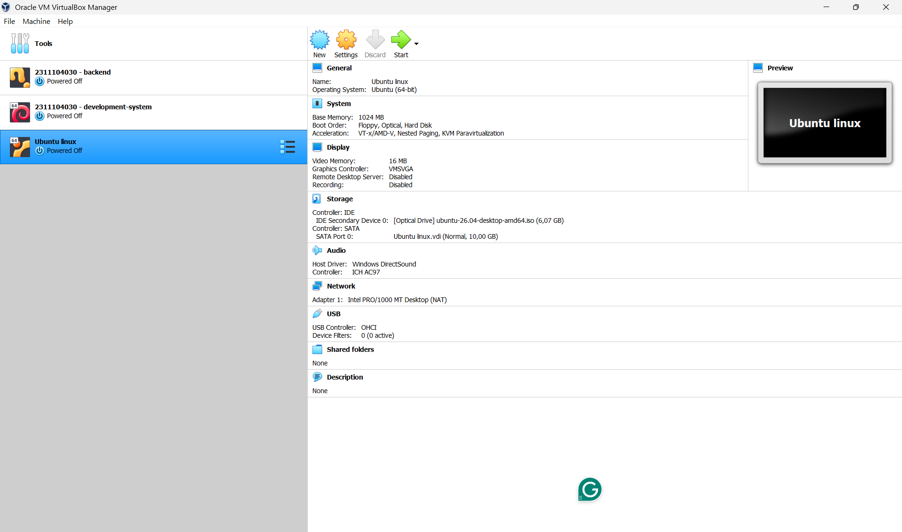

# <h1 align="center">Laporan Praktikum Modul 12   Linux dan Windows</h1>

Isabelle Putri Ardini - 2311104030

## Dasar Teori
Sistem Operasi (SO) atau Operating System (OS) adalah perangkat lunak sistem yang bertugas untuk mengelola seluruh sumber daya perangkat keras (hardware) dan memberikan layanan dasar bagi program aplikasi (software). Tanpa adanya sistem operasi, pengguna tidak akan dapat menjalankan program aplikasi pada komputer mereka, kecuali program booting. Sistem operasi bertindak sebagai jembatan atau lapisan perantara antara pengguna (user) dengan perangkat keras komputer sehingga interaksi dapat berjalan secara efisien dan aman. 

Dua keluarga sistem operasi yang paling populer dan banyak digunakan saat ini adalah Microsoft Windows dan Linux. Windows merupakan sistem operasi komersial (berbayar) yang dikembangkan oleh Microsoft dengan fokus utama pada kemudahan penggunaan melalui antarmuka grafis (Graphical User Interface / GUI) yang sangat intuitif. Di sisi lain, Linux adalah sistem operasi berbasis open-source yang awalnya dikembangkan oleh Linus Torvalds. Linux terkenal dengan stabilitas, keamanan, serta fleksibilitasnya yang tinggi karena memiliki berbagai macam variasi distribusi (distro) yang dapat disesuaikan dengan kebutuhan pengguna, mulai dari kebutuhan harian hingga manajemen server dan sistem benam (embedded system). 

## Guided

### 1. Definisi Sistem Operasi
Sistem Operasi adalah software utama yang dipasang pada komputer untuk mengatur jalannya perangkat keras (seperti prosesor, memori, dan harddisk) serta menyediakan tempat atau wadah agar aplikasi lain (seperti game, browser, atau text editor) bisa berjalan dengan lancar dan bisa digunakan oleh manusia. 

### 2. Analisis dxdiag Windows
- Windows yang diinstal: Windows 11 Home / Pro 
- Arsitektur Bit: 64-bit 
- Kecepatan Processor:  AMD Ryzen 7@ 3.2GHz 
- Versi Grafik: DirectX 12 
- Kelebihan & Versi Terbaru: Kelebihan Windows yang terpasang sekarang (Windows 11) adalah memiliki desain antarmuka yang lebih modern dan minimalis, manajemen jendela (Snap Layouts) yang lebih baik untuk produktivitas, serta keamanan kernel yang lebih diperketat (persyaratan TPM 2.0). Versi Windows terbaru saat ini yang resmi dirilis secara masal adalah Windows 11 (versi 23H2 / 24H2) 

### 3. Analisis VirtualBox dan Linux
- Linux yang diinstall: Ubuntu (64-bit). 
- Arsitektur Bit: 64-bit. 
- Ukuran Hard Disk Virtual:  20 GB. 
- Jumlah Partisi: Berdasarkan standar instalasi otomatis Ubuntu modern yang menggunakan tipe berkas sistem terenkripsi atau manajemen volume dinamis, umumnya terdapat 2 atau 3 partisi utama di dalam hard disk virtual tersebut (yaitu partisi boot /boot/efi, partisi sistem utama root /, dan partisi cadangan swap). 

5 Jenis Distro Linux: 
1. Ubuntu
2. Debian
3. Fedora
4. Arch Linux
5. Linux Mint

3 Jenis Sistem Operasi yang Digunakan Selama Praktikum:
- Microsoft Windows (Sistem operasi utama pada host)
- Linux (Dijalankan melalui VirtualBox)
- Embedded Xinu (Sistem operasi benam/embedded yang dipelajari pada modul-modul sebelumnya)
 

## Referensi

1. Modul Praktikum Sistem Operasi
2. Tanenbaum, A. S., & Bos, H. (2014). Modern Operating Systems (4th ed.). Pearson.
3. Silberschatz, A., Galvin, P. B., & Gagne, G. (2018). Operating System Concepts (10th ed.). John Wiley & Sons.